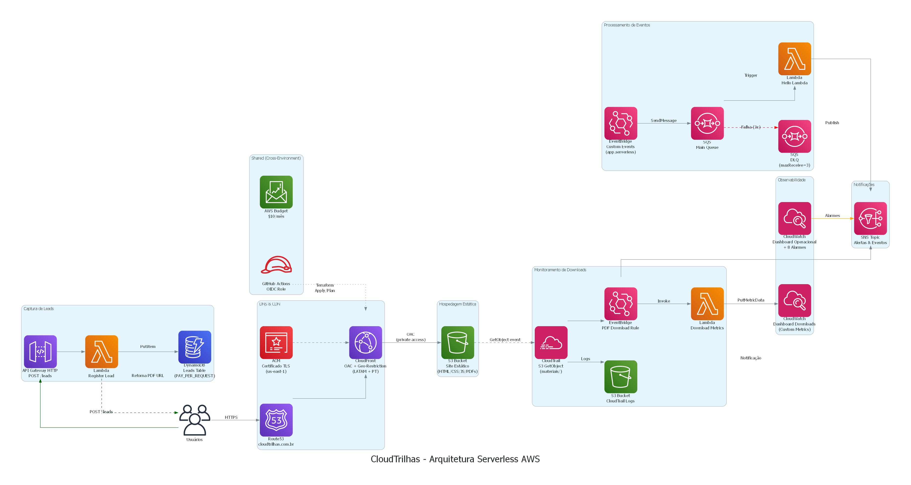

<p align="center">
  
</p>

<h1 align="center">CloudTrilhas — Plataforma Educacional Serverless</h1>

<p align="center">
  <strong>Portal de treinamentos em Cloud, DevOps e Certificações AWS</strong><br/>
  Infraestrutura 100% serverless provisionada com Terraform e CI/CD via GitHub Actions
</p>

<p align="center">
  <a href="https://www.cloudtrilhas.com.br">🌐 Produção</a> •
  <a href="https://www.dev.cloudtrilhas.com.br">🧪 Dev</a> •
  <a href="#arquitetura">📐 Arquitetura</a> •
  <a href="#tecnologias">⚙️ Stack</a>
</p>

---

## 📋 Sobre o Projeto

O **CloudTrilhas** nasceu como um laboratório pessoal para estudar Terraform e serviços AWS. O que começou como exercícios simples de Infrastructure as Code — criar uma Lambda, configurar uma fila SQS — evoluiu organicamente para uma **aplicação real em produção**, com domínio próprio, CI/CD, observabilidade e usuários reais acessando conteúdo.

Essa evolução não foi planejada desde o início. Cada fase do projeto resolveu um problema real: "preciso de HTTPS" levou ao ACM + CloudFront, "preciso saber quem baixou o PDF" levou ao CloudTrail + EventBridge + SNS, "preciso parar de fazer deploy manual" levou ao GitHub Actions + OIDC. O resultado é um projeto que demonstra não apenas conhecimento técnico, mas a capacidade de **evoluir uma arquitetura incrementalmente** — exatamente como acontece em ambientes corporativos.

Hoje o CloudTrilhas é uma plataforma educacional completa com **13 cursos**, **96 páginas** e **13 PDFs** para download, servindo conteúdo real para estudantes de Cloud e DevOps.

O projeto demonstra na prática:

- Infraestrutura como Código com **Terraform** (17 módulos)
- Pipeline CI/CD com **GitHub Actions** + OIDC (zero access keys)
- Arquitetura event-driven com **EventBridge**, **SQS** e **SNS**
- Captura de leads com **API Gateway** + **Lambda** + **DynamoDB**
- Monitoramento com **CloudWatch** (dashboard + 8 alarmes)
- Separação de ambientes **DEV / PROD / SHARED**
- Governança com **AWS Budgets** e **CloudTrail**

---

## 🏗️ Arquitetura

<p align="center">
  
</p>

### Fluxos Principais

| # | Fluxo | Caminho |
|---|-------|---------|
| 1 | **Conteúdo Estático** | Usuário → Route 53 → CloudFront (TLS + Cache) → S3 |
| 2 | **Captura de Leads** | Formulário → API Gateway → Lambda → DynamoDB |
| 3 | **Download de PDFs** | CloudFront → S3 → CloudTrail → EventBridge → SNS + Lambda |
| 4 | **Eventos Customizados** | EventBridge → SQS (+ DLQ) → Lambda → SNS |
| 5 | **Observabilidade** | CloudWatch Alarms → SNS → Email |
| 6 | **CI/CD** | GitHub Actions → OIDC → Terraform Plan/Apply |

---

## ⚙️ Tecnologias

### AWS (17 serviços)

| Serviço | Função |
|---------|--------|
| **S3** | Hospedagem do site estático (HTML, CSS, JS, PDFs) |
| **CloudFront** | CDN global com OAC, HTTPS e geo-restrição |
| **Route 53** | DNS gerenciado (cloudtrilhas.com.br) |
| **ACM** | Certificado TLS (us-east-1 para CloudFront) |
| **API Gateway** | HTTP API v2 — endpoint POST /leads |
| **Lambda** | 3 funções (register_lead, download_metrics, hello_lambda) |
| **DynamoDB** | Tabela de leads (on-demand, PITR habilitado) |
| **SQS** | Fila principal + Dead Letter Queue (3 retries) |
| **SNS** | Notificações por email (downloads, alarmes) |
| **EventBridge** | Roteamento de eventos (downloads + custom) |
| **CloudTrail** | Auditoria de GetObject no S3 |
| **CloudWatch** | Dashboard operacional + 8 alarmes |
| **IAM** | Roles, policies, OIDC para GitHub Actions |
| **AWS Budgets** | Controle de custos (limite $10/mês) |
| **Cognito** | Autenticação de alunos (User Pool, login por email) |

### DevOps & IaC

| Ferramenta | Uso |
|-----------|-----|
| **Terraform** | Módulos reutilizáveis, remote state (S3) |
| **GitHub Actions** | CI/CD com OIDC (sem access keys) |
| **Python 3.12** | Runtime das Lambda functions |
| **Pyodide** | Sandbox Python no navegador (WASM, custo zero) |
| **Puppeteer** | Geração automatizada de PDFs |

---

## 🏦 Conta AWS

| Item | Valor |
|------|-------|
| GitHub | github.com/rscopim/terraform-serverless |
| Região | us-west-2 |
| Domínio (PROD) | https://www.cloudtrilhas.com.br |
| CloudFront (PROD) | E16GA24I7417C2 |
| S3 site (PROD) | materiais-e-trilhas-de-estudos |
| State bucket | terraform-serverless-projeto-trilhas |
| API endpoint | https://eillhz5fkl.execute-api.us-west-2.amazonaws.com |
| Owner | ricardo.simines@gmail.com |

> Detalhes de deploy, rollback e ativação do Cognito em [`docs/deployment.md`](docs/deployment.md).
> Convenções e regras do projeto em [`.kiro/steering/project.md`](.kiro/steering/project.md).

---

## 📂 Estrutura do Projeto

```
terraform-serverless/
├── .github/workflows/       # Pipeline CI/CD (plan + apply)
├── diagram/                 # Diagrama de arquitetura (Python + Graphviz)
├── docs/                    # Documentação por fases (24 fases)
├── environments/
│   ├── dev/                 # Ambiente de desenvolvimento
│   ├── prod/                # Ambiente de produção
│   └── shared/              # Recursos compartilhados (OIDC, Budget)
├── lambda_src/              # Código-fonte das Lambdas (Python 3.12)
│   ├── hello_lambda/        # Consumer SQS → SNS
│   ├── register_lead/       # API → DynamoDB (captura leads)
│   ├── download_metrics/    # EventBridge → CloudWatch metrics
│   ├── analytics/           # Métricas de uso
│   ├── visitor_counter/     # Contador de visitantes
│   ├── costs/               # Consulta de custos AWS
│   ├── governance/          # Governança
│   ├── admin_login/         # Login administrativo
│   └── admin_users/         # Gestão de usuários admin
├── modules/                 # Módulos Terraform reutilizáveis
│   ├── acm/  api_gateway/  budget/  cloudfront/  cloudwatch_dashboard/
│   ├── cloudwatch_operational/  cognito/  download_metrics/  dynamodb/
│   ├── eventbridge/  github_actions_oidc/  lambda/  register_lead_lambda/
│   ├── route53/  s3_static_site/  sns/  sqs/  analytics/  costs/
│   ├── governance/  admin_auth/  visitor_counter_dynamodb/  visitor_counter_lambda/
├── static_site/             # Site estático (HTML/CSS/JS puro)
│   ├── docker/              # trilha Docker
│   ├── terraform/           # trilha Terraform
│   ├── linux/               # trilha Linux
│   ├── python/              # trilha Python (10 módulos)
│   ├── redes/               # trilha Redes (8 módulos)
│   ├── github/              # trilha Git & GitHub (9 módulos)
│   ├── ai-practitioner/     # domínios AWS AI Practitioner
│   ├── developer/           # domínios AWS Developer
│   ├── solutions-architect/ # domínios AWS SA Associate
│   ├── solutions-architect-pro/ # módulos AWS SA Professional
│   ├── cloud-practitioner/  # domínios AWS Cloud Practitioner
│   ├── sandbox.html + sandbox.js  # Sandbox Python (Pyodide, client-side)
│   ├── login.html + cadastro.html # Auth de alunos (Cognito)
│   ├── auth.js + trail-gate.js    # Sessão Cognito + gate das trilhas
│   └── materiais/           # PDFs para download
├── generate-pdf.js          # Script de geração de PDFs (Puppeteer)
└── README.md
```

---

## 🌍 Ambientes

| Ambiente | URL | Propósito |
|----------|-----|-----------|
| **DEV** | https://www.dev.cloudtrilhas.com.br | Testes e validações |
| **PROD** | https://www.cloudtrilhas.com.br | Produção |
| **SHARED** | — | OIDC + Budget (recursos da conta) |

---

## 🔄 CI/CD Pipeline

```
┌──────────────┐     ┌──────────────┐     ┌──────────────┐
│  Push Branch │────▶│  Terraform   │────▶│  Pull Request│
│              │     │  Plan        │     │  (Review)    │
└──────────────┘     └──────────────┘     └──────┬───────┘
                                                  │ Merge
                                           ┌──────┴───────┐
                                           │  Terraform   │
                                           │  Apply       │
                                           │  (auto)      │
                                           └──────────────┘
```

- **Autenticação**: OIDC (sem access keys armazenadas)
- **Validação**: `fmt -check` → `init` → `validate` → `plan`
- **Deploy**: `apply -auto-approve` apenas na main
- **Proteção**: Branch protection + required status checks

---

## 🔐 Segurança

- **OIDC** — GitHub Actions autentica via OpenID Connect (zero secrets de longa duração)
- **IAM Least Privilege** — Cada Lambda tem role com permissões mínimas
- **Encryption** — S3 com SSE, DynamoDB com encryption at rest
- **CloudFront OAC** — S3 não é público, acesso apenas via CloudFront
- **HTTPS** — Certificado ACM em todas as rotas
- **PITR** — Point-in-Time Recovery habilitado no DynamoDB

---

## � Conteúdo da Plataforma

| Curso | Módulos | PDF |
|-------|---------|-----|
| Docker | 7 | ✅ |
| Kubernetes | 4 | ✅ |
| Terraform | 4 | ✅ |
| Linux | 5 | ✅ |
| Python | 10 | ✅ |
| Redes | 12 | ✅ |
| Git & GitHub | 9 | ✅ |
| CloudFormation | 4 | ✅ |
| AWS AI Practitioner | 5 | ✅ |
| AWS Developer | 4 | ✅ |
| AWS SA Associate | 4 | ✅ |
| AWS SA Professional | 7 | ✅ |
| AWS Cloud Practitioner | 4 | ✅ |
| **Total** | **93 módulos** | **13 PDFs** |

---

## � Custos

Arquitetura otimizada para Free Tier + uso baixo:

| Serviço | Custo/mês |
|---------|-----------|
| Route 53 | ~$0.50 |
| S3 + CloudFront | ~$0.05 |
| Lambda + API GW + DynamoDB | ~$0.00 (Free Tier) |
| CloudTrail | ~$0.00 |
| **Total** | **< $1.00/mês** |

Budget configurado com alerta em **$10/mês**.

---

## 🚀 Como Executar

```bash
# Clone o repositório
git clone https://github.com/rscopim/terraform-serverless.git
cd terraform-serverless

# Inicialize o ambiente dev
cd environments/dev
terraform init
terraform plan
terraform apply

# Gerar PDFs (requer Node.js + Puppeteer)
cd ../..
npm install
node generate-pdf.js docker
node generate-pdf.js terraform
# ... etc
```

---

## 📚 Documentação

O CloudTrilhas possui dois conjuntos de documentação complementares.

### Engineering Blueprint

Documentação estratégica da plataforma.

Define a visão do projeto, princípios de engenharia, arquitetura, padrões de desenvolvimento e roadmap de evolução.

📁 Localização:

```text
docs/blueprint/
```

---

### Documentação por Fases

Documentação técnica de cada evolução implementada na plataforma.

Cada fase registra objetivos, arquitetura, implementação, testes, resultados e decisões técnicas adotadas durante o desenvolvimento.

| Fase | Tema |
|-------|------|
| 1–7 | Fundamentos (Lambda, SQS, SNS, EventBridge) |
| 8–11 | Site Estático (S3, CloudWatch, Métricas) |
| 12–14 | API Gateway, Lambda Leads, DynamoDB |
| 15–18 | Route 53, ACM, CloudFront, OAC |
| 19–21 | Well-Architected, Budget, Observabilidade |
| 22–24 | CI/CD, DEV/PROD, Shared Resources |
| 25 | Auditoria Técnica da Plataforma |
| 26 | CloudTrilhas Operations Center |

---

## 👨‍💻 Autor

**Ricardo Simines Scopim**

- AWS Solutions Architect Associate
- AWS Cloud Practitioner
- AWS AI Practitioner
- Instrutor AWS re/Start

[](https://www.linkedin.com/in/ricardosiminesscopim/)
[](https://github.com/rscopim)

---

## 📄 Licença

MIT License — veja [LICENSE](LICENSE) para detalhes.
