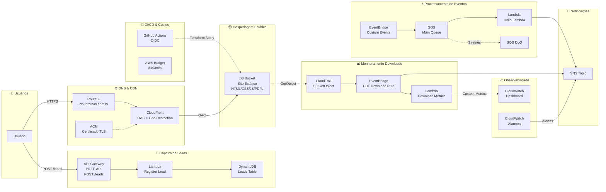

# Diagrama de Arquitetura - CloudTrilhas

## Diagrama com Ícones AWS (PNG)

O arquivo `cloudtrilhas_architecture.png` contém o diagrama completo com ícones oficiais dos serviços AWS.

Para regenerar:
```bash
pip install diagrams
# Instalar Graphviz: https://graphviz.org/download/
python generate_diagram.py
```

## Visão Geral da Arquitetura (Mermaid)



## Serviços AWS Utilizados (17 módulos)

| Serviço | Função |
|---------|--------|
| **Route53** | DNS para cloudtrilhas.com.br |
| **ACM** | Certificado TLS (us-east-1) |
| **CloudFront** | CDN com OAC e geo-restrição (América do Sul + Portugal) |
| **S3** | Hospedagem do site estático (HTML, CSS, JS, PDFs) |
| **API Gateway** | HTTP API v2 - endpoint POST /leads |
| **Lambda (Register Lead)** | Captura leads e grava no DynamoDB |
| **Lambda (Download Metrics)** | Processa eventos de download e publica métricas |
| **Lambda (Hello Lambda)** | Consome mensagens SQS e publica no SNS |
| **DynamoDB** | Tabela de leads (PAY_PER_REQUEST) |
| **SQS** | Fila principal + DLQ (3 retries) |
| **SNS** | Tópico de notificações e alertas |
| **EventBridge** | Roteamento de eventos (downloads + custom) |
| **CloudTrail** | Rastreamento de GetObject no S3 |
| **CloudWatch** | Dashboard operacional + 8 alarmes |
| **AWS Budgets** | Controle de custos ($10/mês) |
| **IAM (OIDC)** | Autenticação GitHub Actions |

## Fluxos Principais

1. **Conteúdo Estático**: Usuário → Route53 → CloudFront (TLS + Geo) → S3
2. **Captura de Leads**: Usuário → API Gateway → Lambda → DynamoDB
3. **Monitoramento Downloads**: S3 → CloudTrail → EventBridge → Lambda/SNS → CloudWatch
4. **Eventos Customizados**: EventBridge → SQS → Lambda → SNS (com DLQ)
5. **Observabilidade**: CloudWatch Alarms → SNS (notificações)
6. **CI/CD**: GitHub Actions → OIDC → Terraform Apply
